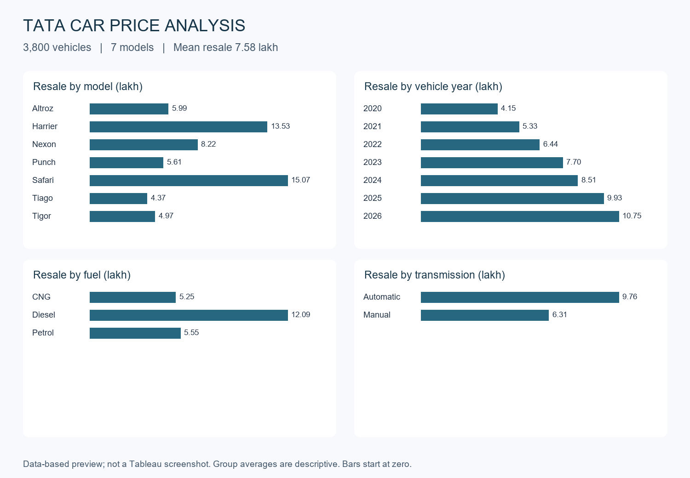

# Car Price Analysis with Tableau

A Tableau workbook project exploring 3,800 Tata car records across seven models. It complements the Python prediction and Excel analysis projects.

**Validation status:** the workbook passes Tableau's official 2026.1 XML schema checks. Tableau is not installed in the authoring environment, so opening, rendering, and interaction in Tableau have not been verified. Schema validity alone does not guarantee successful opening. The preview below is independently generated from the data, not a Tableau screenshot.

## Open the project

1. Download [Car Price Analysis.twbx](Car%20Price%20Analysis.twbx).
2. Open it in Tableau Desktop or Tableau Public Desktop **2026.1 or later**. The package includes the CSV.
3. Open the **Car price overview** dashboard. Inspect the individual worksheet tabs for model, vehicle year, fuel, transmission, and price-gap comparisons.
4. If prompted to locate the CSV, unzip the TWBX into a folder and select `Data/cars.csv`, then open `Car Price Analysis.twb` from that same folder.

The version is intentional: the official 2026.1 schema and ManifestByVersion require Tableau 2026.1 or later. Native application validation is the remaining verification step.

## Workbook contents

| Worksheet | Fields and aggregation |
|---|---|
| Resale by model | Model and AVG(resale_price_lakh), bars |
| Resale by vehicle year | Discrete vehicle year and AVG(resale_price_lakh), line |
| Resale by fuel | Fuel type and AVG(resale_price_lakh), bars |
| Resale by transmission | Transmission and AVG(resale_price_lakh), bars |
| Price gap by model | Model and AVG(price_gap_pct), bars |

The overview has four charts and a snapshot summary. The summary text reflects this source file and must be updated if the data changes. The fifth worksheet remains available separately. Custom dashboard filters and actions are not configured; reviewers can add fuel/transmission filters in Tableau and apply them to worksheets using this data source.

## Calculated fields

```text
price_gap = [ex_showroom_price_lakh] - [resale_price_lakh]

price_gap_pct =
IF [ex_showroom_price_lakh] > 0 THEN
    ([ex_showroom_price_lakh] - [resale_price_lakh]) / [ex_showroom_price_lakh]
END
```

Price gap is a depreciation proxy, not a measured annual depreciation rate. The percentage field is stored as a decimal fraction (0.32 means 32%). Configure Percentage number formatting in Tableau if desired.

## Findings

- Mean resale price: **7.58 lakh** across 3,800 cars.
- Safari has the highest model average, **15.07 lakh**; Tiago has the lowest, **4.37 lakh**.
- Vehicle-year comparisons describe different cars in a snapshot, not repeated observations or a time-series forecast.

Full group counts and means are in [analysis-results.json](analysis-results.json). Differences may reflect model mix, age, trim, condition, and other variables; these charts do not estimate causal effects.

## Data and limitations

The embedded CSV is the car capstone dataset supplied through the user's local project context. It has 3,800 unique car IDs and 16 source columns with no missing cells. Original publisher, sampling method, and data license have not been verified. Treat this as an educational sample. Third-party data retains its original terms and is not relicensed under the repository code license.

Prices retain the source's lakh units (100,000 currency units); currency is not explicitly stated. All records are Tata. `mileage_kmpl` is fuel efficiency, while `kilometers_driven` is distance travelled.

## Validation

- Validated TWB structure against the [official Tableau 2026.1 schema](https://github.com/tableau/tableau-document-schemas). The two external namespace imports omitted from the schema repository were supplied locally; the workbook uses neither optional namespace attribute set.
- Confirmed five worksheet definitions, one dashboard, source fields, 3,800 unique IDs, and package integrity.
- Reconciled aggregate results with the source CSV and preserved its SHA-256 in [validation.json](validation.json).
- **Not tested:** native Tableau opening/rendering, calculated-field execution, and dashboard interactions.



## Website

The portfolio displays this static preview and provides workbook downloads. It is not an embedded Tableau Public visualization. A live Tableau embed requires publishing the workbook to Tableau Public or Tableau Cloud and obtaining a view URL.

[Tableau packaged workbook documentation](https://help.tableau.com/current/pro/desktop/en-us/save_savework_packagedworkbooks.htm)
