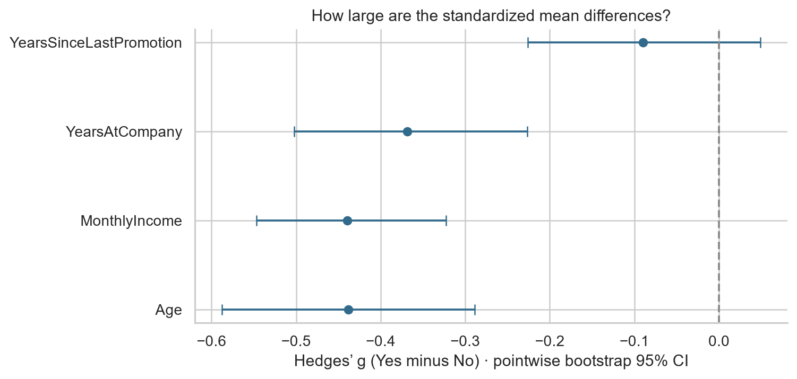
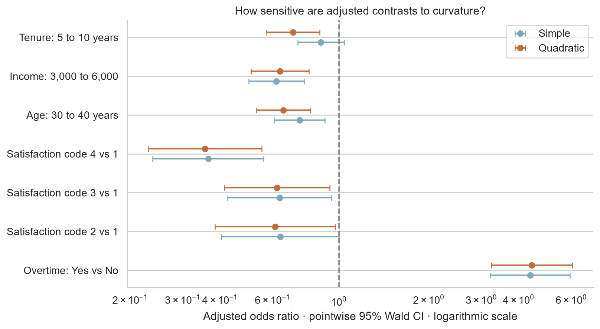

# Employee Attrition — Statistical Analysis

**Are observed employee differences statistically significant, how strong are the relationships, and how uncertain are the estimates?**

A Python statistics portfolio project using the supplied Employee Attrition CSV. The analysis covers 1,470 records and 35 columns, including 237 Attrition “Yes” and 1,233 “No” records. It emphasizes statistical reasoning, effect sizes and uncertainty rather than another KPI dashboard.

## Read the project

[Read the live report](https://luckson-git.github.io/my-portfolio/employee-attrition-statistics.html).

- [Executed Jupyter notebook](statistical_analysis.ipynb): complete hypotheses, code, outputs and interpretations.
- [Browser-readable report](statistical_analysis.html): download and open locally; includes code, tables and embedded figures.
- [Detailed result tables](results/): full-precision values, contingency counts, assumption checks and model diagnostics.

## Questions and methods

Ten focused primary hypotheses examine six categorical associations (overtime, job role, department, business travel, marital status and job satisfaction) and four numerical mean contrasts (age, monthly income, company tenure and years since last promotion).

- **Categorical:** Pearson chi-square tests with expected-count checks and Cramér's V; overtime also receives risk difference, risk ratio and odds ratio estimates with 95% intervals.
- **Numerical:** two-sided Welch t-tests, mean-difference intervals, signed Hedges' g and 5,000-resample bootstrap intervals. Welch answers a mean question and does not assume equal variance.
- **Multiplicity:** α = 0.05; joint Benjamini–Hochberg correction for all ten primary tests, with Holm as a sensitivity check.
- **Correlation:** six Spearman correlations among career-related measures assess shared variation, with a separate exploratory BH family.
- **Adjusted inference:** a compact logistic model includes overtime, age, log income, company tenure and categorical satisfaction. Diagnostics detected curvature, so a quadratic extension and concrete covariate contrasts are reported. Coefficient and contrast families are separately labeled and adjusted.

Every primary analysis states its question, null and alternative hypotheses, assumptions, statistic, p-value, effect size and interpretation. Confidence intervals are pointwise, not simultaneous. The analysis is exploratory rather than preregistered.

## Primary evidence

Numeric effects use Attrition Yes minus No; V is unsigned. Full degrees of freedom, intervals and Holm results are in the notebook and results/primary_tests.csv.

| Variable | Statistic | Raw p | BH-adjusted p | Effect size |
|---|---:|---:|---:|---:|
| OverTime | χ² = 89.04 | 3.86e-21 | 3.86e-20 | V = 0.246 |
| JobRole | χ² = 86.19 | 2.75e-15 | 1.38e-14 | V = 0.242 |
| Department | χ² = 10.80 | 0.00453 | 0.00503 | V = 0.086 |
| BusinessTravel | χ² = 24.18 | 5.61e-06 | 8.01e-06 | V = 0.128 |
| MaritalStatus | χ² = 46.16 | 9.46e-11 | 2.36e-10 | V = 0.177 |
| JobSatisfaction | χ² = 17.51 | 0.000556 | 0.000695 | V = 0.109 |
| Age | t = -5.83 | 1.38e-08 | 2.76e-08 | g = -0.438 |
| MonthlyIncome | t = -7.48 | 4.43e-13 | 1.48e-12 | g = -0.440 |
| YearsAtCompany | t = -5.28 | 2.29e-07 | 3.81e-07 | g = -0.368 |
| YearsSinceLastPromotion | t = -1.29 | 0.199 | 0.199 | g = -0.090 |

### A. Statistically significant primary findings
After BH correction across 10 tests: OverTime, JobRole, Department, BusinessTravel, MaritalStatus, JobSatisfaction, Age, MonthlyIncome, YearsAtCompany. These are associations under the stated sampling assumptions, not causal findings.

### B. Non-significant primary findings
YearsSinceLastPromotion. For YearsSinceLastPromotion, the mean difference is -0.29 years (95% CI -0.73 to 0.15; BH p=0.199). Non-significance does not establish equality or equivalence.

### C. Effects with interpretable magnitude
Overtime “Yes” and “No” have recorded attrition proportions of 30.5% and 10.4%: difference 20.1 percentage points (95% CI 15.4 to 25.0), risk ratio 2.93, odds ratio 3.77. This is a substantial descriptive contrast; intervention benefit is unknown.

The Attrition “Yes” group is 3.95 years younger on average (Yes minus No 95% CI -5.29 to -2.62); mean MonthlyIncome is 2,045.65 dataset units lower (95% CI -2,583.05 to -1,508.24). Hedges’ g values are -0.438 and -0.440. No business-relevant minimum effect has been specified.

### D. Significance need not imply practical importance
Department has Cramér’s V=0.086 and BH p=0.00503. The magnitude is modest on the 0–1 V scale despite statistical evidence. Significance alone does not justify a department-specific policy. Rating-code associations cannot be translated into survey interventions without a codebook.

**Adjusted extension.** Overtime's adjusted OR is 4.42 (95% CI 3.24–6.04) in the quadratic model. The curvature diagnostic favors this extension over constant numeric slopes (LR p=5.38e-07). Tenure and satisfaction-code-2 conclusions vary across specifications; treat them as model-sensitive exploratory evidence, not settled findings. Adjusted ORs describe conditional odds, not causal effects or changes in probability.

## Statistical figures

The other two figures show distribution/normality diagnostics and overtime proportions with Wilson intervals. Every plot supports an inferential question; no dashboard or variable ranking is included.

## Data and preprocessing

No missing cells, blank strings, duplicate rows or repeated employee identifiers were detected. Screened negative-value and tenure-consistency checks found no violations. This is not proof that every value is correct.

All rows and plausible extremes are retained. EmployeeCount, Over18 and StandardHours are constant; EmployeeNumber is an identifier. They are excluded from inference. Ratings are treated as categories; storage types are not mistaken for measurement scales. Income remains in unspecified dataset units.

The source is copied without modification. Its SHA-256 fingerprint and software versions appear in [run_manifest.json](results/run_manifest.json). No codebook, sampling design, provenance documentation or redistribution license accompanied the file. See [data notes](data/README.md).

## Limitations

Independence is assumed, not established by unique IDs. Team clustering, sampling bias, unmeasured confounding, unknown timing and measurement definitions limit interpretation. If the data are synthetic or a complete fixed workforce snapshot, inferential uncertainty is illustrative rather than evidence about a defined external population.

Skewed income and tenure motivate assumption checks and bootstrap sensitivity. Outliers remain because tail observations can be legitimate. Regression specification changes some conclusions; single-case influence checks are limited. Separate testing families do not provide one study-wide 5% error guarantee, and pointwise intervals are not multiplicity-adjusted.

These are associations, not effects of changing overtime, compensation or employment policy. No minimum actionable effect or intervention cost is available. No causal, fairness, or deployment claim is made.

## How this differs from the other portfolio projects

| Existing project described in the brief | Contribution here |
|---|---|
| MySQL: validation, CTEs, windows and retention questions | Focused hypotheses, explicit sampling assumptions and uncertainty |
| Power BI: KPIs, group comparisons, overtime and tenure | Significance versus magnitude, corrected tests, interval estimates |
| Descriptive findings | Conditional associations and model-sensitivity assessment |

The comparison uses the supplied descriptions; actual SQL and Power BI artifacts were not provided. SQL queries, DAX, dashboard cards and category rankings are deliberately absent.

## Reproduce

Use Python 3.12 and run from this project directory. The supplied notebook is already executed; a local HTML copy is available without Jupyter.

~~~bash
python -m venv .venv
~~~

Activate the environment: Windows PowerShell uses .venv\Scripts\Activate.ps1; macOS/Linux uses source .venv/bin/activate.

~~~bash
python -m pip install -r requirements.txt
python -m ipykernel install --user --name employee-attrition --display-name "Employee Attrition"
python -m nbconvert --to notebook --execute --inplace --ExecutePreprocessor.kernel_name=employee-attrition --ExecutePreprocessor.timeout=300 statistical_analysis.ipynb
python -m nbconvert --to html statistical_analysis.ipynb
~~~

Alternatively open the notebook in a Jupyter-compatible editor, select this environment, and restart/run all cells. Execution recreates result tables and figures in place. Keep the original CSV filename and project-relative folder structure. Fixed random seed: 20260916; 5,000 bootstrap resamples per numeric comparison.

The notebook contains numerical consistency assertions and writes a run manifest. It records the actual package versions used on execution; requirements.txt pins those analysis and execution dependencies. Transitive packages and operating-system details can still affect reproducibility.

## Repository layout

~~~text
employee-attrition-statistical-analysis/
  README.md
  statistical_analysis.ipynb
  statistical_analysis.html
  requirements.txt
  data/
    WA_Fn-UseC_-HR-Employee-Attrition.csv
    README.md
  results/
    primary_tests.csv
    numeric_tests.csv
    logistic_regression.csv
    nonlinear_model_coefficients.csv
    adjusted_contrasts.csv
    findings.md
    run_manifest.json
    ... assumption checks and supporting tables
  visualizations/
    distributions_and_normality.png
    overtime_confidence_intervals.png
    standardized_mean_differences.png
    adjusted_odds_ratios.png
~~~

**Tools:** Python, Pandas, NumPy, SciPy, Statsmodels, Matplotlib, Seaborn and Jupyter/IPython.

**Method references:** [SciPy Welch test](https://docs.scipy.org/doc/scipy/reference/generated/scipy.stats.ttest_ind.html), [SciPy chi-square](https://docs.scipy.org/doc/scipy/reference/generated/scipy.stats.chi2_contingency.html), [Statsmodels multiplicity](https://www.statsmodels.org/stable/generated/statsmodels.stats.multitest.multipletests.html). Empirical results use only the supplied CSV.
